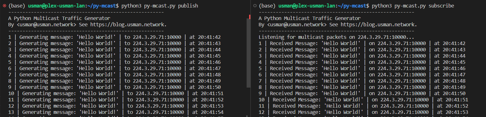

## py-mcast

* A simple python program to generate multicast traffic on a multicast group.
* Uses python sockets and argparse.

---

# Developer Notes
```bash
conda create -n py-mcast
conda activate py-mcast
poetry install
```
If using VSCode SSH remote, change interpreter to conda env python path.

e.g. `/home/usman/miniconda3/envs/py-mcast/bin/python3`

Confirm with `which python3`
```bash
(network-automation) usman@dev-usman-lan:~/network-automation$ which python
/home/usman/miniconda3/envs/py-mcast/bin/python3
```

## Usage

* Assuming a multicast capable network (PIM, IGMP, etc) is in configured:
  * On the publisher, run `python3 py-mcast.py publish`
  * And on the subscribers, run `python3 py-mcast.py subscribe`

* Mcast group, port, ttl, interval and the message can be changed using the CLI arguments, remember to reflect change on both ends.

* Tested on a Linux hosts, but should work on Windows as well (might have to modify firewall).

* Set `--interval` as 0 to generate traffic continuously. 
    * This generates ~20mbps of traffic. 
    * Warning: this will cause a multicast storm if network isn't configured properly.

---


## Arguments for `py-mcast.py`
```bash
python3 py-mcast.py -h
usage: py-mcast [-h] [-addr MULTICAST_ADDRESS] [-p PORT] [-m MESSAGE] [-c COUNT] [-ttl TTL] [-ivl INTERVAL] job

A Python Multicast Traffic Generator.

positional arguments:
  job                   Action to do, publish or subscribe

options:
  -h, --help            show this help message and exit
  -addr MULTICAST_ADDRESS, --multicast-address MULTICAST_ADDRESS
                        multicast address to publish to
  -p PORT, --port PORT  port to publish to multicast packets on.
  -m MESSAGE, --message MESSAGE
                        message to multicast
  -c COUNT, --count COUNT
                        number of messages to send
  -ttl TTL, --ttl TTL   TTL of multicast packets .
  -ivl INTERVAL, --interval INTERVAL
                        Interval between multicast packets. 0 = 20mbps flood.

By <usman@usman.network> See https://blog.usman.network.
```

---
## Example
