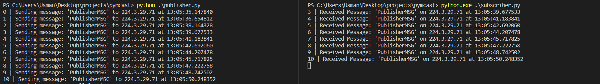

* A simple python program to generate multicast traffic for a multicast group.
* Uses python sockets.

---

## Usage

* Assuming a multicast capable network (PIM, IGMP, etc) is in configured, run `publisher.py` on a server, and then `subscriber.py` on various hosts.

* Mcast group and port can be configured in `publisher.py`, remember to reflect changes in `subscriber.py`.

* Tested on a Linux hosts, but should work on Windows as well (might have to modify firewall).

* Remove `time.sleep(1.5)` publisher.py to generate traffic continuously. This generates ~20mbps of traffic. Warning: this will cause a multicast storm if network isn't configured properly.

---

## Example
